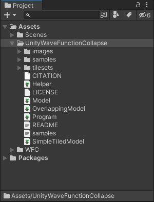
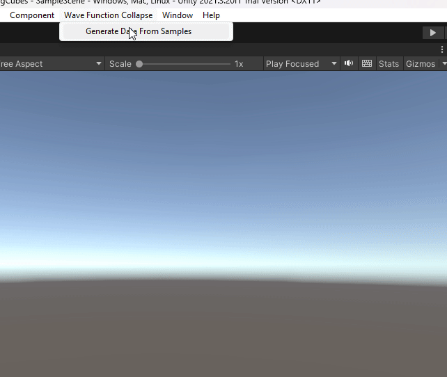

# WaveFunctionCollapse
This is a Port of [Wave Function Collapse Algorithm]("https://github.com/mxgmn/WaveFunctionCollapse") To be used in Unity.

It took longer then expected to get it to get the colors correct on the output files. Had to use the Load Image instead of Load Texture methods. and when saving the Texture had to us Texture Format ARGB32 for saving. See Helper.cs

Now that I have the colors correct. Will work on getting it to do it at runtime with settings that you can change and watch it update the texture in real time, along with adding a selection where you can manually start drawing the output texture and have it finish the rest for you. Then it will be on to 3D and taking a deep dive into combing marching cubes and this, along with Model Synthesis. Stay tuned!

Pleas referer to the original github for a complete explanation.

---

### Brief Summary
From original github.

> This program generates bitmaps that are locally similar to the input bitmap.
> 

> 

> 
> Local similarity means that
> 
> * (C1) The output should contain only those NxN patterns of pixels that are present in the input.
> * (Weak C2) Distribution of NxN patterns in the input should be similar to the distribution of NxN patterns over a sufficiently large number of outputs. In other words, probability to meet a particular pattern in the output should be close to the density of such patterns in the input.
> 
> In the examples a typical value of N is 3.
> 

> 
> Note that the tiles have the same symmetry type as their assigned letters (or, in other words, actions of the 
dihedral group D4 are isomorphic for tiles and their corresponding letters). With this system it's enough to enumerate pairs of adjacent tiles only up to symmetry, which makes lists of adjacencies for tilesets with many symmetrical tiles (even the summer tileset, despite drawings not being symmetrical the system considers such tiles to be symmetrical) several times shorter.
> 

> 
> 
> 
> 
> 
> 
> 
> 
> 

>
> Note that the unrestrained knot tileset (with all 5 tiles being allowed) is not interesting for WFC, because you can't run into a situation where you can't place a tile. We call tilesets with this property "easy". Without special heuristics easy tilesets don't produce interesting global arrangements, because correlations of tiles in easy tilesets quickly fall off with a distance. Many easy tilesets can be found on [Guy Walker's website](http://cr31.co.uk/stagecast/wang/tiles_e.html). Consider the "Dual" 2-edge tileset there. How can it generate knots (without t-junctions, not easy) while being easy? The answer is, it can only generate a narrow class of knots, it can't produce an arbitrary knot.
>
> Note also that Circuit, Summer and Rooms tilesets are non-Wang. That is, their adjacency data cannot be induced from edge labels. For example, in Circuit two Corners cannot be adjacent, yet they can be connected with a Connection tile, and diagonal tracks cannot change direction.

---

## How to build
Import into you Unity Project inside a folder called UnityWaveFunctionCollapse.

After Importing select Wave Function Collapse -> Generate Data from Samples
Once the Editor Window Opens select the samples xml and press generate.

Generated results are put into the `output` folder. Edit `samples.xml` to change model parameters.

## Credits

### Wave Function Collapse Algorithm

### authors:
- family-names: Gumin 
- given-names: Maxim 
- email: ExUtumno@gmail.com

### version: 1.0

### date-released: 2016-09-30

### keywords:
    - procedural generation
    - texture synthesis
    - machine learning
    - constraint satisfaction

### url: [Wave Function Collapse Algorithm](https://github.com/mxgmn/WaveFunctionCollapse)

---

### Original Credits

Circles tileset is taken from [Mario Klingemann](https://twitter.com/quasimondo/status/778196128957403136). FloorPlan tileset is taken from [Lingdong Huang](https://github.com/LingDong-/ndwfc). Summer tiles were drawn by Hermann Hillmann. Cat overlapping sample is taken from the Nyan Cat video, Water + Forest + Mountains samples are taken from Ultima IV, 3Bricks sample is taken from Dungeon Crawl Stone Soup, Qud sample was made by Brian Bucklew, MagicOffice + Spirals samples - by rid5x, ColoredCity + Link + Link 2 + Mazelike + RedDot + SmileCity samples - by Arvi Teikari, Wall sample - by Arcaniax, NotKnot + Sand + Wrinkles samples - by Krystian Samp, Circle sample - by Noah Buddy. The rest of the examples and tilesets were made by Maxim Gumin, the original Poster. Idea of generating integrated circuits was suggested to Maxim Gumin by [Moonasaur](https://twitter.com/Moonasaur/status/759890746350731264) and their style was taken from Zachtronics' [Ruckingenur II](http://www.zachtronics.com/ruckingenur-ii/). Voxel models were rendered in [MagicaVoxel](http://ephtracy.github.io/).

---
